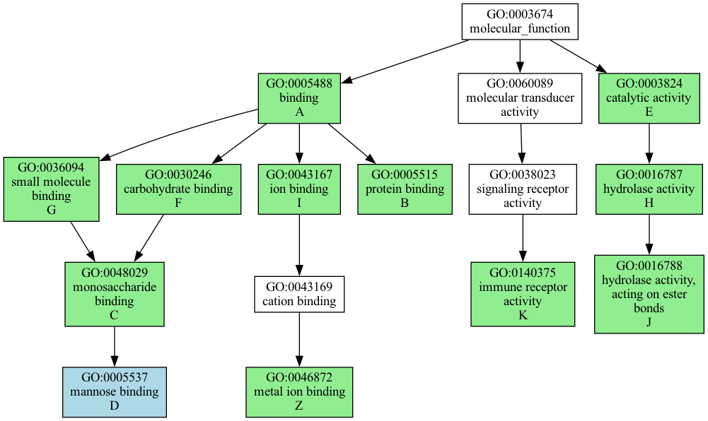

# GeneScape

The `genescape` suite a collection of tools used to visualize the results of functional genome analysis. Various new tools may be implemented in the future.

* `tree` draws informative gene ontology (GO) graphs based on GO terms.
* `annotate` annotates a list of genes with functions

## genescape tree

Starting with a file that contains GO terms (see [goids.txt](src/genescape/data/goids.txt) for the complete file)
:

```
GO:0005488
GO:0005515
GO:0048029
GO:0005537
GO:0003824
...
```

run the `tree` command to visualize the relationships between the GO terms:

```console
genescape tree -o output.pdf goids.txt 
```

The command generates the following output:


The image displays the GO subtree that contains all the input GO terms. Here's what each color means:

* Green nodes: These are the GO terms from your list.
* Light blue nodes: These are leaf nodes (the end points of the tree) representing the most granular annotation possible.
* White nodes: These connect the green nodes, forming the tree's structure. These represent the minimal ancestral nodes needed to interconnect your GO terms.

### Default labels

When labels are not explicitly provided, an automatic node labeling will take place using two numbers separated by a slash.

1. The first number indicates the count of nodes in the subtree starting from that node.
2. The second number is the total number of nodes in the complete annotation tree. 

For example, a node labeled `16/11235` indicates there are `16` nodes in the subtree beginning at that node. In the larger tree before filtering to your specific GO terms, this node's subtree had `11,235` nodes. 

The numbers and colors are meant to assist in understanding the level of detail and the specificity of the functional terms you visualize.

### Custom labels

The input may also take the form of a CSV file with headers. In that case the content of the columns `goids` and `labels` will be processed. Example:

```
goids,labels
GO:0005488,A
GO:0005515,B
GO:0048029,C
GO:0005537,D
...
```

Would generate `A`, `B`, `C`, `D`, and `E` instead of the `X/Y` numbers.  




When the input is in CSV format, only the green nodes (nodes in the input list) will be labeled.

## genescape annotate

The annotator operates on gene names. To run it needs the so called GAF annotation file that is available from the [GO website](http://current.geneontology.org/annotations/). 

The human GAF file is included in the distribution and will be used by default. For other organisms, or to use the most up-to-date GAF for human, you would need to download the GAF file for your organism of interest and provide it to the annotator like so `-g goa_human.gaf.gz`.

Suppose you have a list of gene names in the format

```
Cyp1a1
Sphk2
Sptlc2
Smpd3
```

The command:

```console
genescape annotate names.txt 
```

will generate the file containing the top 10 most common functions:

```
goids,labels
GO:0005515,3/4
GO:0005743,2/4
GO:0043231,2/4
GO:0005789,2/4
...
```

The numbers in this file represent how many of your input genes were annotated with the given function. 
Piping the output into `genescape tree` will generate an image that visualizes the functional roles of the genes in the input file.

```console
genescape annotate names.txt  | genescape tree
```

will generate the output:


## Installation

You can install `genescape` via `pip` or `pipx`.

Since the software is meant to be used as a command line tool, [pipx][pipx] is recommended.

```bash
pipx install genescape
```

[pipx]: https://pipx.pypa.io/stable/

To generate images, from command line you need to have the `dot` software from [Graphviz](https://graphviz.org/) installed and available on your `PATH`. You can install Graphviz via your package manager or via `conda` with:

```console  
conda install graphviz
```

Alternatively, if you are unable to install the `dot` package you can save the output as `.dot` files via the flag `-o graph.dot` and then use an online tool like [viz-js](http://viz-js.com/) to visualize the graph.


## License

`genescape` is distributed under the terms of the [MIT](https://spdx.org/licenses/MIT.html) license.
