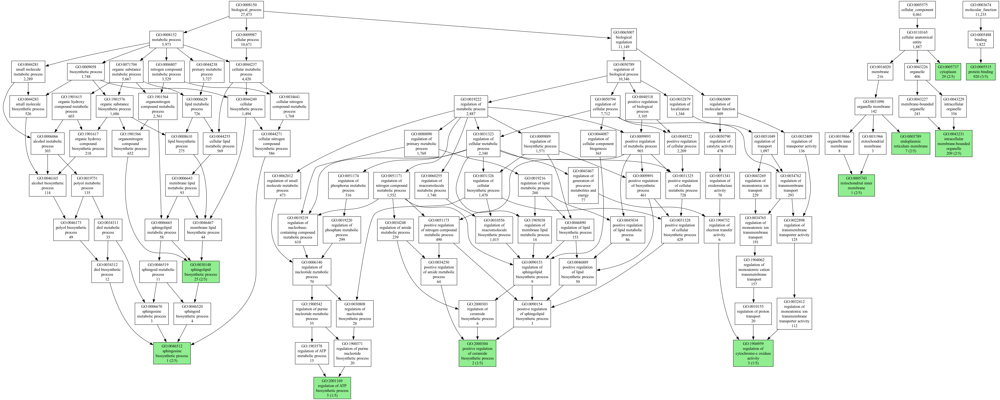
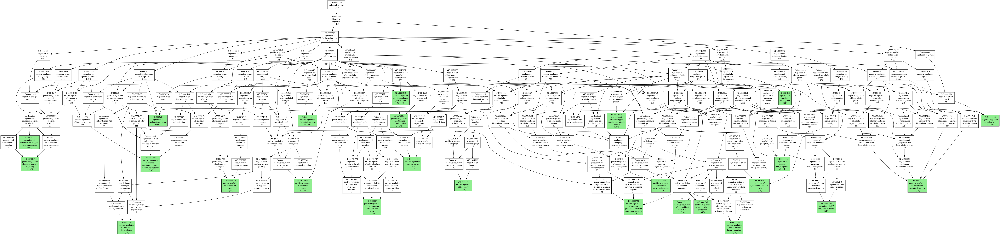

# Genescape

The `genescape` suite is a collection of tools used to visualize the results of functional genome analysis. Various new tools may be implemented in the future.

* `tree` draws informative Gene Ontology (GO) subgraphs
* `annotate` annotates a list of genes with GO functions

We packaged demo data with the software so you can test the programs like so:

```console
genescape tree --demo
genescape annotate --demo
genescape annotate --demo | genescape tree
```

See [Installation](#installation) on how to get started.

## genescape tree

Starting with a file that contains GO terms (see [goids.txt](src/genescape/data/goids.txt) for the complete file)
:

```
GO:0005488
GO:0005515
GO:0048029
GO:0005537
GO:0003824
...
```

run the `tree` command to visualize the relationships between the GO terms:

```console
genescape tree -o output.pdf goids.txt 
```

The command generates the following output:



Read more about how [genescape tree](docs/gs_tree.md) works.

## genescape annotate

The annotator operates on gene names. Suppose you have a list of gene names in the format:

```
Cyp1a1
Sphk2
Sptlc2
Smpd3
```

The command:

```console
genescape annotate names.txt 
```

will generate the file containing the top 10 most common functions across these genes:

```
goid,count,size,label
GO:0005515,3,4,3/4
GO:0043231,2,4,2/4
GO:0005789,2,4,2/4
GO:0005743,2,4,2/4
GO:0030148,2,4,2/4
GO:0005737,2,4,2/4
GO:0046512,2,4,2/4
GO:0042904,1,4,1/4
GO:0006805,1,4,1/4
GO:0009624,1,4,1/4
...
```

The numbers in this file represent how many of your input genes were annotated with the given function relative to the total number of genes (4).

Piping the output of `genescape annotate` into `genescape tree` will generate an image that visualizes the functional roles of the genes in the input file.

```console
genescape annotate names.txt | genescape tree
```


The output is a functional map of the genes::



By default, only the top 10 most common functions are generated. That cutoff can be changed via the `-t` flag

The human annotation file (GAF) is included in the distribution and will be used by default. 

For other organisms, or to use the most up-to-date GAF for human, you would need to download the GAF file for your organism of interest and provide it to the annotator like so `-g goa_human.gaf.gz`. The GAF files are available on the [GO website](http://current.geneontology.org/annotations/). 

## Installation

The software requires Python 3.9 or above. You can install `genescape` via `pip` or `pipx`.

Since the software is meant to be used as a command line tool, [pipx][pipx] is the recommended approach. 

```console
pipx install genescape
```

Alternatively, you can also use `pip` to install:

```console
pip install genescape
```

[pipx]: https://pipx.pypa.io/stable/

To generate images from the command line you will need to have the `dot` software from [Graphviz](https://graphviz.org/) installed and available on your `PATH`. You can install Graphviz via your package manager or via `conda` with:

```console  
conda install graphviz
```

Alternatively, if you are unable to install the `dot` package you can save the output as `.dot` files 

```console
genescape tree -o graph.dot --demo
```

Then use an online tool like [viz-js](http://viz-js.com/) to visualize the graph.

## License

`genescape` is distributed under the terms of the [MIT](https://spdx.org/licenses/MIT.html) license.
