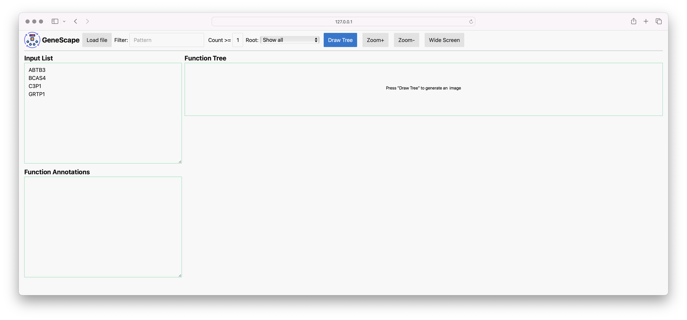
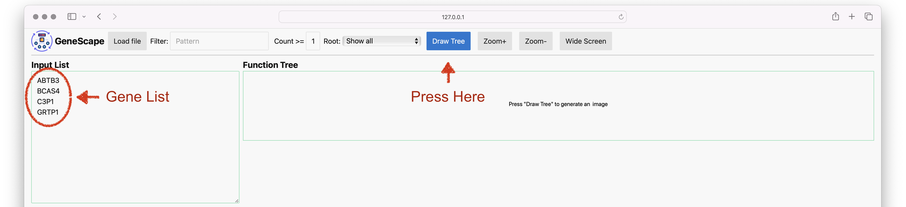
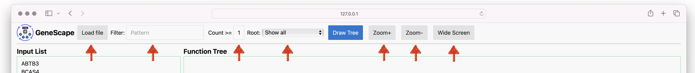

# Genescape

The `genescape` suite is a collection of tools used to visualize the results of functional genome analysis. Various new tools may be implemented in the future.

* `tree` draws informative Gene Ontology (GO) subgraphs
* `annotate` annotates a list of genes with GO functions
* `web` provides a web interface for the `tree` command

We provide standalone executables for GeneScape that can be run  without any installation. The software can also operate in command line mode.

## Quick start

Doubleclick the executable to start the program. You will get an interface that looks like this:



Fill in the text box with a list of genes names or GO terms or gene names and click the `Draw Tree` button to visualize the relationships between the GO terms.



The program will generate a tree visualization.


Note all the options available in the interface:



## Command line usage

See the installation below on how to get the command line version.

To start the web interface type:

```console
genescape web
```

A web browser will start with the interface above.

## genescape tree

You can also use GeneScape completely from the command line with no web interface.

We packaged test data with the software so you can test it like so:

```console
genescape tree --test
```

Which will generate a tree visualization of the test data.


You can pass to the tree visualizer a list of genes or a list of GO ids, or even a mix of both:

```
Cyp1a1
Sphk2
Sptlc2
```

run the `tree` command to visualize the relationships between the GO terms 

```console
genescape tree genes.txt -o output.pdf
```

The command generates the following output that shows a huge tree of terms.


You can narrow down the visualization to terms that only contain the word lipid via:

```console
genescape tree -m lipid genes.txt -o output.pdf
```


```console
genescape tree -h
```
Read more about how [genescape tree](docs/gs_tree.md) works.

## genetrack annotation

The annotator operates on gene names. Suppose you have a list of gene names in the format:

```
Cyp1a1
Sphk2
Sptlc2
Smpd3
```

The command:

```console
genescape annotate -t --csv
```

will produce the output:

```
gid,root,count,function,source,size,label
GO:0090630,BP,1,activation of GTPase activity,GRTP1,4,(1/4)
GO:0046982,MF,1,protein heterodimerization activity,ABTB3,4,(1/4)
GO:0031083,CC,1,BLOC-1 complex,BCAS4,4,(1/4)
GO:0016020,CC,1,membrane,ABTB3,4,(1/4)
GO:0005737,CC,1,cytoplasm,BCAS4,4,(1/4)
GO:0005615,CC,1,extracellular space,C3P1,4,(1/4)
GO:0005096,MF,1,GTPase activator activity,GRTP1,4,(1/4)
GO:0004866,MF,1,endopeptidase inhibitor activity,C3P1,4,(1/4)
```


#
## Installation

For a standalone executable, download the latest release from the [releases page][release]

[release]: ...

When isntalled from the command line the software requires Python 3.10 or above. 

You can install `genescape` via `pip` or `pipx`.

```console
pip install genescape
```

Since the software is meant to be used as a command line tool, [pipx][pipx] is perhaps an even better choice:

```console
pipx install genescape
```

If only use the web interface aka `genescape web` no other software installation is needed.

If you want to generate images from the command line, you will also need to have the `dot` software from [Graphviz](https://graphviz.org/) installed and available on your `PATH`. 

You can install Graphviz via your package manager or via `conda` with:

```console  
conda install graphviz
```

[pipx]: https://pipx.pypa.io/stable/

If you are unable to install the `dot` package you can save the output as `.dot` files 

```console
genescape tree -o graph.dot --demo
```

Then use an online tool like [viz-js](http://viz-js.com/) to visualize the graph.

## License

`genescape` is distributed under the terms of the [MIT](https://spdx.org/licenses/MIT.html) license.
