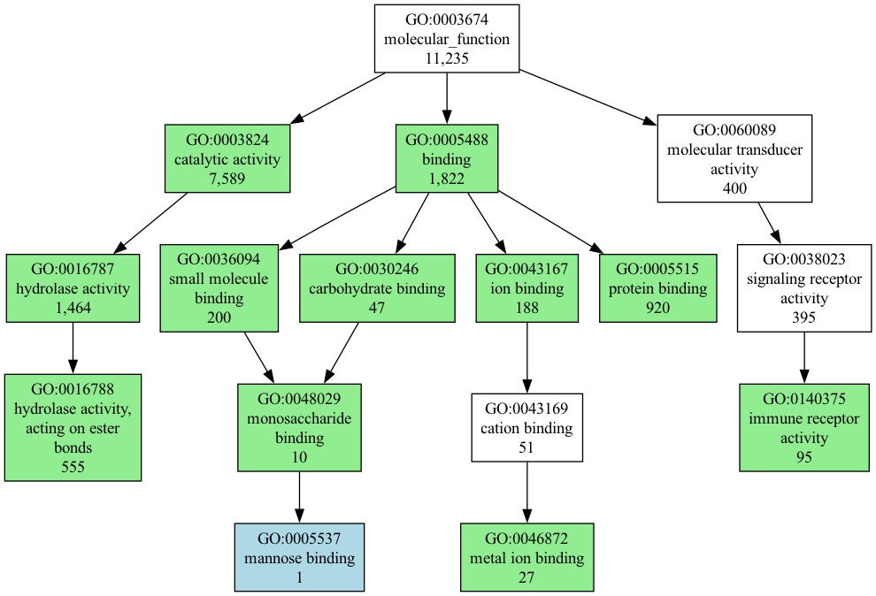

# GeneScape

[](https://pypi.org/project/genescape)
[](https://pypi.org/project/genescape)

-----

- [Installation](#installation)
- [License](#license)

The `genescape` suite is meant to be a collection of tools used to visualize gene ontology and the results of functional analysis. 

* `tree` draws informative gene ontology (GO) graphs.

## genescape tree

Starting with a file that contains GO terms (see [goids.txt](src/genescape/data/goids.txt) for the complete file)
:

```
GO:0005488
GO:0005515
GO:0048029
GO:0005537
GO:0003824
```

the command below uses the file

```console
genescape tree -o demo.png goids.txt 
```

to generate the following graph:



Legend:

The image displays a subtree with various colored nodes representing different types of Gene Ontology (GO) terms from a provided list. Here's what each color means:

* Green nodes: These are the GO terms from your list.
* Light blue nodes: These are leaf nodes (the end points of the tree) from your list.
* White nodes: These connect the green nodes, forming the tree's structure. They are ancestral nodes.

Additionally, each node shows two numbers:

The first number indicates the count of nodes in the subtree starting from that node.

The second number shows the total number of nodes in the original, larger tree that this subtree is a part of. 

For example, a node labeled "16/11235" means there are 16 nodes in the subtree beginning at that node. In the larger tree before filtering to your specific GO terms, this node's subtree had 11,235 nodes. These numbers help you understand the level of detail or specificity in the functional annotation.


## Installation

Recommended installation is via `pip` or `pipx`: 

```console
pipx install genescape
```

To run the tool you will need to have the `dot` command from [Graphviz](https://graphviz.org/) installed and available on your `PATH`. You can install Graphviz via your package manager or via `conda` with:

```console  
conda install graphviz
```

## License

`genescape` is distributed under the terms of the [MIT](https://spdx.org/licenses/MIT.html) license.
