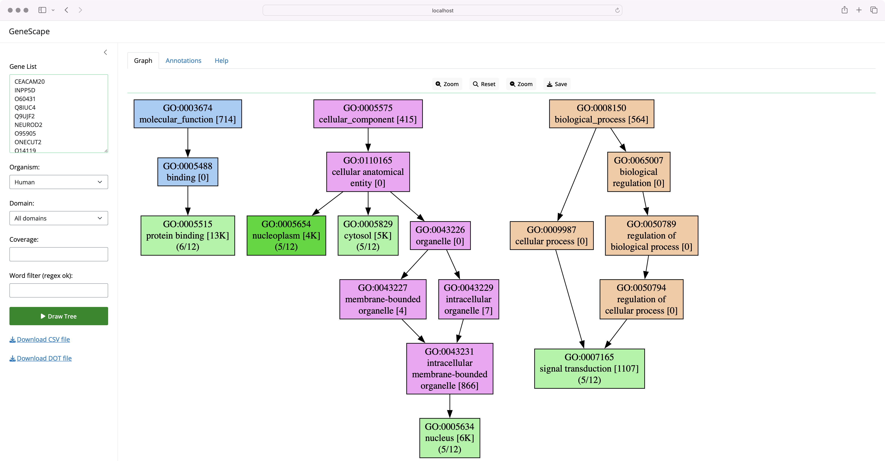

# Summary

The Gene Ontology (GO)  [@Ashburner2000; @GO2023] is a structured vocabulary that describes gene products in the context of their associated functions. The ontology takes the form of a directed graph, where each node defines a term, and each edge represents a hierarchical relationship between the terms (the words of the vocabulary).

For example, in the GO data, `GO:0090630` defines *activation of GTPase activity* and is a child of `GO:0043547`, defined as *positive regulation of GTPase activity* which in turn is a child of `GO:0051345` representing *positive regulation of hydrolase activity*. 

Gene association files (GAF) are text files used to annotate an organism's gene products with Gene Ontology terms, associating a function to a gene product. For example, a GAF file connects a gene product label, such as `ZC3H11B`, with multiple GO terms, such as `GO:0046872` or `GO:0016973`. The complete human genome GAF representation contains 288,575 associations of 19,606 gene symbols with over 18,680 GO terms.

The [Gene Ontology Consortium][GO] maintains GAF files for various organisms. Typical genomic analysis protocols generate gene lists that must be placed in a functional context. 

[GO]: https://geneontology.org/

# Statement of need

The most annotated gene in the human genome, `HTT`, currently has 1100 annotations. Thus, even small lists of genes may have a large number of annotations presenting an extraordinary challenge for interpretation. There is a clear need to visualize shared gene functions in an informative manner. 

Web-based tools designed to visualize and filter gene ontology data include `AmiGO` [@AmiGO] and `QuickGO` [@QuickGO]. Command line tools like `goatools` [@goatools] support GO term lineage visualization. R packages like `topGO` [@topGO] implement GO structure visualizations of enriched GO terms. We are unaware of locally installable software that specifically allows for interactive filtering and visualization of gene ontology derived on gene lists.

GeneScape is a Python package that allows users to visualize a list of gene products in terms of the functional context represented by the Gene Ontology. 

GeneScape is distributed both as a command-line tool and as GUI-enabled standalone software via the [Shiny platform][shiny] [@shiny], thus making it accessible to a wide range of users.

{height="216pt"}

[shiny]: https://shiny.posit.co/

GeneScape comes with a number of prebuilt databases for model organisms including the human, mouse, rat, fruitfly and zebrafish genomes. To study additional organisms, users must download GAF files from the Gene Ontology website and create custom databases using the `build` subcommand:

```
genescape build --gaf mydata.gaf.gz --index mydata.index.gz 
```

For detailed instructions on using the software, users should refer to the [GeneScape documentation][docs]. A Q&A discussion board is also available on the GeneScape GitHub page.

[genescape]: https://github.com/ialbert/genescape-central
[docs]: https://github.com/ialbert/genescape-central

## Typical usage

A typical usage starts with a gene list such as: 

```
ABTB3 
BCAS4
C3P1
GRTP1
```

Users can process the list above via the command line or via the Shiny interface. A command line invocation might look like:

```console
genescape tree genes1.txt -o output.pdf
```

The command above will produce the image:

![Ontology subgraph for a gene list \label{fig:interface}][img_shiny]{height="216pt"}

[img_shiny]: images/gs_output_1.png

Internally, GeneScape first transforms the input gene list into a GO term list, where additional information is added to each term:

```
Coverage,Function,Domain,GO,Genes
1,endopeptidase inhibitor activity,MF,GO:0004866,C3P1
1,GTPase activator activity,MF,GO:0005096,GRTP1
1,extracellular space,CC,GO:0005615,C3P1
1,cytoplasm,CC,GO:0005737,BCAS4
1,membrane,CC,GO:0016020,ABTB3
1,PDZ domain binding,MF,GO:0030165,ABTB3
1,BLOC-1 complex,CC,GO:0031083,BCAS4
1,"synaptic transmission, glutamatergic",BP,GO:0035249,ABTB3
1,exploration behavior,BP,GO:0035640,ABTB3
1,protein heterodimerization activity,MF,GO:0046982,ABTB3
1,protein stabilization,BP,GO:0050821,ABTB3
1,activation of GTPase activity,BP,GO:0090630,GRTP1
1,glutamatergic synapse,CC,GO:0098978,ABTB3
```

In the next step, GeneScape draws the GO terms as the graph structure using the Networkx package [@networkx] helping users visualize the functional context of the genes relative to the larger Gene Ontology.

Various colors and labels are used to provide additional context to the nodes in the graph; for example, functions present in the input genes are colored green. The intermediate nodes are colored by their category. Node labels display the total annotations and the number of genes that carry that function.

![Filtering a large graph for a specific term \label{fig:help}][img_help]{height="216pt"}

[img_help]: images/node_help_1.png

In the web interface, users can zoom in and out of the tree. The software's command-line version supports generating outputs in various formats, such as PDF or PNG. 

Since the resulting graphs may also be large, with thousands of nodes, the main interface provides input widgets that allow users to interactively 
reduce the subgraph to nodes for which:

1. The function definitions match certain patterns.
2. A minimum number of genes share a function. 
3. Nodes belong to a specific GO subtree: Biological Process (BP), Molecular Function (MF), Cellular Component (CC).

As an example, take the input genelist of just four genes:

```
Cyp1a1
Sphk2
Sptlc2
Smpd3
```

the resulting functional ontology graph is large with 641 nodes and 1007 edges:

![Very few genes can produce a large ontology tree \label{fig:huge}][img_bigtree]

[img_bigtree]: images/gs_output_2.png

Users can reduce the tree to show only terms that match the word `lipid` and with at least two genes supporting the function via the graphical user interface or the command line:

```console
genescape tree -m lipid --micov 2 genes2.txt -o output.pdf
```

The filtering process will result in a smaller tree with 18 nodes and 29 edges focused on the functions that contain the word "lipid":

![Filtering a large graph for a specific term \label{fig:filter}][img_filter]{height="216pt"}

[img_filter]: images/gs_output_3.png


The software's primary purpose is to allow users to assess the functional depth of genes and to identify commonalities and differences in the functional context of these genes.

# Acknowledgments

We acknowledge support from the Huck Institutes for the Life Sciences at the Pennsylvania State University.

# References
