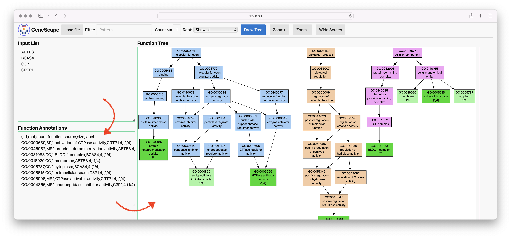

# Summary

Gene Ontologies (GOs)  [@Ashburner2000], [@GO2023] are standardized and structured vocabulary that describes gene products in the context of their associated functions. The ontologies take the form of a directed graph structure, where each node defines a term, and each edge represents a hierarchical relationship between the words of the vocabulary.

For example, in the GO data, `GO:0090630` defines *activation of GTPase activity* and is a child of `GO:0043547`, which is a *positive regulation of GTPase activity* that in turn is a child of `GO:0051345` representing a *positive regulation of hydrolase activity*. 

Gene association files (GAF) are text files used to annotate an organism's gene products with Gene Ontology terms, thereby associating a function with a gene product. For example, a GAF file connects a gene product label such as `ZC3H11B` with multiple GO terms, such as `GO:0046872` or `GO:0016973`. 

The [Gene Ontology Consortium]GO] maintains GAF files for various organisms. These GO and GAF datasets are used by all processes that interpret genomic data in a functional context.  Typical data genomic analysis protocols generate gene lists that must be placed into a functional context.

[GO]: https://geneontology.org/

# Statement of need

The most annotated gene for the human genome (`HTT1` had 1098 annotations at the time of writing this document). Thus, even small lists of genes may a have large number annotations and that are challenging to interpret. There is a need to visualize shared gene functions in an informative manner.

GeneScape is a Python package that allows users to visualize a list of gene products in terms of the functional context as represented by the Gene Ontology. The package provides both a graphical user interface and a command-line interface to assist users with different levels of computational expertise. 

A typical usage strart with a gene list such as: 

```
ABTB3 
BCAS4
C3P1
GRTP1
```

GeneScape first transforms the above gene input list into a GO term list, where additional information is added to each term:

```
GO:0090630,BP,1,activation of GTPase activity,GRTP1,4,(1/4)
GO:0046982,MF,1,protein heterodimerization activity,ABTB3,4,(1/4)
GO:0031083,CC,1,BLOC-1 complex,BCAS4,4,(1/4)
GO:0016020,CC,1,membrane,ABTB3,4,(1/4)
GO:0005737,CC,1,cytoplasm,BCAS4,4,(1/4)
GO:0005615,CC,1,extracellular space,C3P1,4,(1/4)
GO:0005096,MF,1,GTPase activator activity,GRTP1,4,(1/4)
GO:0004866,MF,1,endopeptidase inhibitor activity,C3P1,4,(1/4)
```

In the next step GeneScape visualizes the GO terms as the graph structure that represents the functional context of the genes relative to the larger Gene Ontology.



Various colors are used to provide additional context to the nodes in the graph. Green nodes are the functions that the input genes were annotated by. The intermediate nodes are colored by their category. Since the resulting grapsh may also be large, with thousands of nodes, the main interface provides reactive interface elements to allow users to filter the graph by:

1. Word patterns that match the function definitions
2. A minimum number of genes share the function 
3. A specific GO subtree: Biological Process, Molecular Function, Cellular Component

In addition, users can zoom in and out of the tree. The software's command-line version supports generating outputs in various formats, such as PDF or PNG.

The software's main purpose is to allows users to assess the functional depth of genes and to identify commonalities and differences in the functional context of these genes.

# Acknowledgements

We acknowledge support from the Huck Institutes for the Life Sciences at the Pennsylvania State University.

# References
