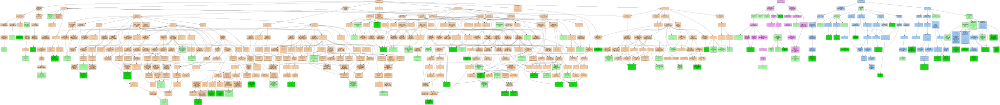
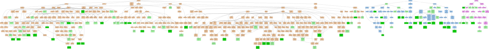
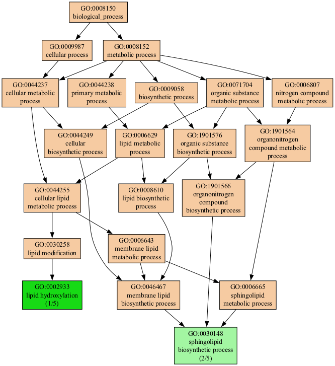

# Summary

The Gene Ontology (GO)  [@Ashburner2000; @GO2023] is a structured vocabulary that describes gene products in the context of their associated functions. The ontology takes the form of a directed graph, where each node defines a term, and each edge represents a hierarchical relationship between the terms (the words of the vocabulary).

For example, in the GO data, `GO:0090630` defines *activation of GTPase activity* and is a child of `GO:0043547`, which is a *positive regulation of GTPase activity* which in turn is a child of `GO:0051345` representing a *positive regulation of hydrolase activity*. 

Gene association files (GAF) are text files used to annotate an organism's gene products with Gene Ontology terms, associating a function to a gene product. For example, a GAF file connects a gene product label, such as `ZC3H11B`, with multiple GO terms, such as `GO:0046872` or `GO:0016973`. The complete human genome GAF representation contains 288,575 associations of 19,606 gene symbols over 18,680 GO terms.

The [Gene Ontology Consortium][GO] maintains GAF files for various organisms. Typical genomic analysis protocols generate gene lists that must be placed in a functional context. 

[GO]: https://geneontology.org/

# Statement of need

The most annotated gene in the human genome, `HTT1`, currently has 1098 annotations. Thus, even small lists of genes may have a large number of annotations presenting an extraordinary challenge for interpretation. There is a clear need to visualize shared gene functions in an informative manner. 

Web-based tools designed to visualize and filter gene ontology data include `AmiGO` [@AmiGO] and `QuickGO` [@QuickGO]. Command line tools like `goatools` [@goatools] support GO term lineage visualization. R packages like `topGO` [@topGO] implement GO structure visualizations of enriched GO terms. We are unaware of locally installable software that specifically allows for interactive filtering and visualization of gene ontology derived on gene lists.

GeneScape is a Python package that allows users to visualize a list of gene products in terms of the functional context represented by the Gene Ontology. GeneScape is distributed both as a command-line tool and as GUI-enabled standalone software that does not require Python to be installed on the user's computer, thus making it accessible to a wide range of users.

GeneScape is distributed with prebuilt databases for human and mouse genomes. For other organisms, users need to download the GAF files from the Gene Ontology website and run the command:

```
genescape build --gaf mydata.gaf --index mydata.index.gz 
```

The `build` command will create a database that can then be used for all subsequent analyses with the software. Users should consult the [GeneScape documentation][docs] for up-to-date details. 

[genescape]: https://github.com/ialbert/genescape-central
[docs]: https://github.com/ialbert/genescape-central

A typical usage starts with a gene list such as: 

```
ABTB3 
BCAS4
C3P1
GRTP1
```

GeneScape first transforms the above gene input list into a GO term list, where additional information is added to each term:

```
gid,root,count,function,source,size,label
GO:0090630,BP,1,activation of GTPase activity,GRTP1,4,(1/4)
GO:0046982,MF,1,protein heterodimerization activity,ABTB3,4,(1/4)
GO:0031083,CC,1,BLOC-1 complex,BCAS4,4,(1/4)
GO:0016020,CC,1,membrane,ABTB3,4,(1/4)
GO:0005737,CC,1,cytoplasm,BCAS4,4,(1/4)
GO:0005615,CC,1,extracellular space,C3P1,4,(1/4)
...
```

In the next step, GeneScape visualizes the GO terms as the graph structure that represents the functional context of the genes relative to the larger Gene Ontology.

{height="216pt"}

Various colors are used to provide additional context to the nodes in the graph; for example, functions derived from the input genes are colored green. The intermediate nodes are colored by their category. 

Since the resulting graphs may also be large, with thousands of nodes, the main interface provides input widgets that allow users to interactively 
reduce the subgraph to nodes for which:

1. The function definitions match certain patterns
2. A minimum number of genes share a function, 
3. Nodes belong to a specific GO subtree: Biological Process (BP), Molecular Function (MF), Cellular Component (CC)

As an example, take the input genelist of just four genes:

```
Cyp1a1
Sphk2
Sptlc2
Smpd3
```

the resulting functional ontology graph is huge:



Users can reduce the tree to show only terms that match the word `lipid` via the graphical user interface or the command line:

```console
genescape tree -m lipid genes.txt -o output.pdf
```

The filtering process will result in a smaller tree focused on the lipid-related terms:

{height="216pt"}

In addition, users can zoom in and out of the tree. The software's command-line version supports generating outputs in various formats, such as PDF or PNG. 

The software's primary purpose is to allow users to assess the functional depth of genes and to identify commonalities and differences in the functional context of these genes.

# Acknowledgments

We acknowledge support from the Huck Institutes for the Life Sciences at the Pennsylvania State University.

# References
